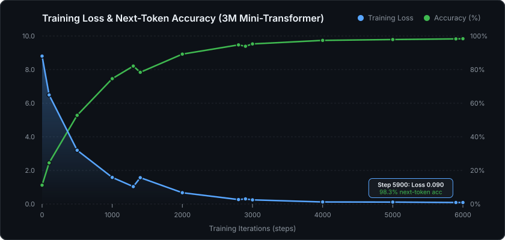
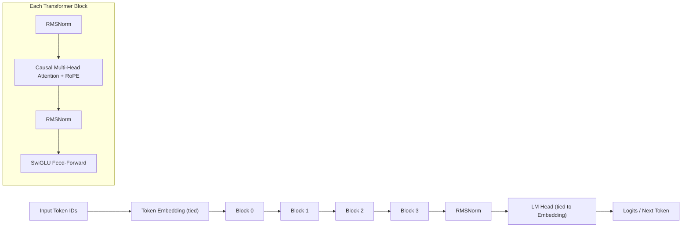

# mini-transformer

<p align="center">
  
  
  
  
  
</p>

A ~3M-parameter decoder-only Transformer language model, written from first principles in PyTorch and trained on real text. No `transformers`, no `nn.Transformer` — RMSNorm, RoPE, SwiGLU, causal multi-head attention, Byte-Level BPE tokenizer, ChatML formatting, and nucleus sampling are all here in clean, tested PyTorch.

The goal is mathematical transparency at a scale you can watch train on a laptop in minutes.

---

## Architecture at a Glance

| Component | Standard GPT-2 (2019) | `mini_transformer` (LLaMA 3-style) | Rationale |
|---|---|---|---|
| **Positional Embedding** | Learned Absolute Positional Embeddings | **Rotary Position Embeddings (RoPE)** | Relative attention rotations; extrapolates past block size |
| **Normalization** | Post / Pre LayerNorm | **Pre-RMSNorm** | Omits mean centering; 10–15% faster compute & memory |
| **Feed-Forward (FFN)** | GELU / ReLU MLP | **SwiGLU** | Bilinear gating mechanism improves representation flow |
| **LM Head** | Separate Projection Weight | **Tied to Token Embedding** | Cuts parameter count by ~30% and regularizes embedding space |
| **Serialization** | Pickle-based `.pt` only | **`.pt` + Zero-copy `.safetensors`** | Safe zero-copy memory mapping without arbitrary code execution |
| **Inference** | Naive $O(n^2)$ autoregression | **KV-Cache + ChatML + Streaming** | $O(n)$ cached token steps, interactive multi-turn chat |

---

## Quickstart

```bash
# 1. Install dependencies
uv sync

# 2. Try story generation with the included TinyStories model:
uv run python -m mini_transformer.generate \
  --checkpoint checkpoints/tinystories.safetensors \
  --tokenizer checkpoints/tinystories_tokenizer.json \
  --prompt "Once upon a time, Lily " \
  --clean

# 3. Interactive ChatML conversation mode:
uv run python -m mini_transformer.generate --chat --clean

# 4. Inspect model tensor dimensions, memory footprint & FLOPs:
uv run mini-summary \
  --checkpoint checkpoints/tinystories.safetensors \
  --tokenizer checkpoints/tinystories_tokenizer.json

# 5. Evaluate loss and perplexity:
uv run mini-eval
```

Console scripts `mini-transformer`, `mini-eval`, and `mini-summary` are pre-installed in the virtual environment.

---

## Two Pre-trained Models Included

### 1. `TinyStories` — Coherent Story Generation
Trained on `roneneldan/TinyStories` for 4,000 steps (~4m 30s on Apple MPS with `bfloat16`). Produces coherent, grammatically correct English children's stories with dialogue, quotation marks, and emotions.

```bash
uv run python -m mini_transformer.generate \
  --checkpoint checkpoints/tinystories.safetensors \
  --tokenizer checkpoints/tinystories_tokenizer.json \
  --prompt "Tim looked at the dog and said, \"Hello! Who are you?\" The dog " \
  --clean --n 80
```

*Verbatim output:*
> *Once upon a time, Lily Anna was playing with her chalk! All the people around Molly's room were so tired from her 3rd birthday.*
> *They spent the rest of the afternoon adding the yarn together. They laughed and sang as they worked.*
>
> *At the end of the day, Tim said goodbye to his. He said, "I like counting leaves. It's fun!"*
> *His dad smiled and said, "You're welcome. Let's pick a happy dream for you."*

### 2. `WikiText-2` — Corpus Memorization Benchmark
Trained on 200,000 characters of WikiText-2 for 6,000 steps on Apple MPS. Reaches a training loss of **0.090** and **98.3% teacher-forced accuracy**, reproducing historical text nearly verbatim.

```bash
uv run python -m mini_transformer.generate \
  --checkpoint checkpoints/model.safetensors \
  --tokenizer data/tokenizer.json \
  --prompt "The " \
  --temperature 0.0 --repetition-penalty 1.2 --clean --n 100
```

---

## Benchmark & Training Performance

Every number was measured on a fresh run on an Apple Silicon laptop with MPS backend:

| Metric | WikiText-2 Model | TinyStories Model |
|---|---|---|
| **Training Loss (Final)** | **0.090** (step 5900) | **0.613** (step 4000) |
| **Wall Clock** | **440 s (7 m 20 s)** | **267 s (4 m 27 s)** |
| **BPE Vocabulary** | **6,582** tokens | **5,077** tokens |
| **Parameters** | **3,034,944** | **2,745,984** |
| **Context Window** | 128 tokens | 128 tokens |
| **Precision** | FP32 | Mixed-precision (`bfloat16`) |
| **Device** | Apple MPS | Apple MPS |

<p align="center">
  
</p>

---

## Model Architecture & Parameter Inspection

Inspect tensor shapes, layer-by-layer parameter counts, memory footprint, and theoretical FLOPs:

```bash
uv run python -m mini_transformer.summary \
  --checkpoint checkpoints/tinystories.safetensors \
  --tokenizer checkpoints/tinystories_tokenizer.json
```

```
======================================================================
 MiniTransformer Architecture Summary
======================================================================
 Vocabulary:     5,077 tokens
 Context Window: 128 tokens
 Architecture:   4 layers | 192 d_model | 6 heads | 512 d_ff
 Attention:      RoPE (head_dim=32) | RMSNorm | SwiGLU | Tied Head
----------------------------------------------------------------------
 Layer                    Specs / Shape                    Parameters
----------------------------------------------------------------------
 Token Embedding          (5077, 192)                         974,784
 TransformerBlock 0       d_model=192, n_head=6, d_ff=512     442,752
 TransformerBlock 1       d_model=192, n_head=6, d_ff=512     442,752
 TransformerBlock 2       d_model=192, n_head=6, d_ff=512     442,752
 TransformerBlock 3       d_model=192, n_head=6, d_ff=512     442,752
 Final RMSNorm            (192,)                                  192
 LM Head (tied)           (5077, 192)                          (tied)
----------------------------------------------------------------------
 Total Parameters:     2,745,984
 Transformer Stack:    1,771,200
 Embedding (tied):     974,784
 FP32 Memory:          10.48 MB
 BF16 / FP16 Memory:   5.24 MB
 FLOPs / token (fwd):  ~5,491,968
======================================================================
```

---

## CLI Reference

### Text Generation (`mini_transformer.generate`)

```bash
# Nucleus sampling with repetition penalty
uv run python -m mini_transformer.generate --n 200 --temperature 0.8 --top-p 0.95 --repetition-penalty 1.2

# Streaming token generation
uv run python -m mini_transformer.generate --prompt "Once upon a time " --stream --clean

# Interactive prompt loop
uv run python -m mini_transformer.generate -i --clean

# Multi-turn ChatML conversation
uv run python -m mini_transformer.generate --chat --clean

# Early stopping on end-of-text
uv run python -m mini_transformer.generate --stop-on-eot
```

### Model Training (`mini_transformer.train`)

```bash
# Train on TinyStories with bfloat16 mixed precision:
uv run python -m mini_transformer.train \
  --dataset roneneldan/TinyStories \
  --dataset-config default \
  --corpus-chars 500000 \
  --iters 4000 \
  --mixed-precision bf16 \
  --data-dir data/tinystories \
  --out checkpoints/tinystories.pt

# Train on WikiText with validation split & early stopping:
uv run python -m mini_transformer.train \
  --eval-interval 200 \
  --val-fraction 0.05 \
  --early-stopping-patience 3
```

| Flag | Default | Description |
|---|---|---|
| `--dataset` | `Salesforce/wikitext` | HuggingFace dataset path |
| `--dataset-config` | `wikitext-2-raw-v1` | HuggingFace dataset configuration name |
| `--corpus-chars` | `200000` | Maximum character slice to stream and pack |
| `--iters` | `6000` | Total training iterations |
| `--batch-size` | `8` | Training batch size |
| `--lr` | `6e-3` | Peak learning rate (with warmup & cosine decay) |
| `--mixed-precision` | `no` | Enable AMP mixed precision (`no`, `bf16`, `fp16`) |
| `--eval-interval` | `0` | Steps between validation evals (`0` disables) |
| `--early-stopping-patience` | `0` | Consecutive unimproved evals before stopping |
| `--resume` | `False` | Resume training from existing checkpoint & optimizer state |

---

## Architecture Diagram



---

## Project Structure

```
mini_transformer/
  config.py             Frozen dataclass holding all hyperparameters (strict JSON round-trip)
  tokenizer.py          Byte-Level BPE tokenizer training, ChatML format_chat, encode/decode
  data.py               Streaming corpus ingestion, uint16 binary packing, batch sampler
  model.py              MiniTransformer: embedding, RMSNorm block stack, tied head, generate()
  transformer_block.py  Pre-norm block (Attention + SwiGLU FFN with residual branches)
  multi_head_attention.py Causal MHA with Rotary Position Embeddings (RoPE) and SDPA
  feed_forward.py       SwiGLU (Swish-Gated Linear Unit) MLP
  rmsnorm.py            Root Mean Square Normalization
  rope.py               Rotary Position Embeddings precomputation and 2D rotation
  sampling.py           Sampling: temperature, top-p nucleus, top-k, repetition penalty
  init.py               GPT-2 scaled normal weight initialisation
  train.py              Training pipeline: warmup, cosine decay, AMP mixed precision, AdamW
  generate.py           Generation CLI: streaming, KV-cache, ChatML interactive loop, cleaner
  eval.py               Evaluation CLI: cross-entropy loss and Perplexity (PPL)
  summary.py            Model architecture inspector: tensor shapes, memory, and FLOPs
  py.typed              PEP 561 type annotation marker
checkpoints/            Pre-trained checkpoints (.pt, .safetensors), configs, and tokenizers
tests/                  136 offline unit and regression tests (100% pass)
```

---

## Testing & Quality

```bash
uv run ruff check .        # strict linting (E402, B rules enabled)
uv run pytest -q           # 136 tests, ~9s, fully offline (no network, no HF cache)
uv build                   # wheel and sdist package build
```

The test suite requires no network and runs entirely offline. Tests enforce causal masking, weight tying invariance, RoPE rotation properties, KV-cache numerical equivalence, checkpoint serialization, and CLI contracts.

---

## License

MIT — see [LICENSE](LICENSE).
